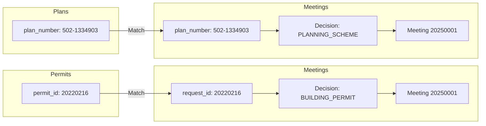

# Data Enrichment Structure & Connections

## Overview

This document explains how permits, plans (Taba), and municipal meeting discussions (Yeshivot) are connected and enriched to create complete profiles for each development project.

## Data Sources

### 1. Permits (`permits/opportunities.json`)
Building permit applications that have been identified as investment opportunities.

**Key Field**: `permit_id` (e.g., "20220216")

### 2. Plans (`taba/bat_yam_plans_data.json`)
Urban planning schemes (Taba) that define zoning, building rights, and land use.

**Key Field**: `plan_number` (e.g., "502-1334903")

### 3. Meetings (`yeshivot/processed_json/all_meetings_data.json`)
Municipal committee meeting protocols where permits and plans are discussed and decided upon.

**Contains**: Decisions for both permits (`BUILDING_PERMIT`) and plans (`PLANNING_SCHEME`)

## Connection Logic

### How They Connect

```
Meeting Discussion
       │
       ├─> BUILDING_PERMIT decision
       │   └─> request_id matches permit_id in Permits
       │
       └─> PLANNING_SCHEME decision
           └─> plan_number matches plan_number in Plans
```

### Matching Flow



## Tree Structure Examples

### Example 1: Permit with Meeting History

```
Permit: 20220216 (גנוסר 4, בת ים)
├── Original Data
│   ├── project_type: "תכנית בניה עירונית - תב\"ע"
│   ├── description: "הריסת שני מבנים קיימים..."
│   ├── address: "גנוסר 4, בת ים"
│   └── applicants: {...}
│
└── meeting_history: [1 meeting]
    └── Meeting 20250001 (21/01/2025)
        ├── essence: "הריסת שני מבנים קיימים ובניה של בניין מגורים..."
        ├── decision_status: "אושר"
        └── Result: Approved with 22 new units
```

### Example 2: Plan with Multiple Meeting Discussions

```
Plan: 502-1334903 (דרך בן גוריון 101-103)
├── Original Data
│   ├── plan_type: "תכנית מפורטת"
│   ├── plan_name: "מבנה משולב מלונאות ומגורים"
│   ├── general_info: {...}
│   └── history: [...]
│
└── meeting_history: [1 meeting]
    └── Meeting 20250001 (30/01/2025)
        ├── decision_stage: "דיון - המלצה למחוזית"
        ├── decision_summary: "הוועדה המליצה שלא לקדם..."
        ├── changes_description: "שינוי ייעוד בתא שטח 101..."
        └── Result: Committee recommended NOT to advance in current format
```

### Example 3: Permit with No Meeting Discussion

```
Permit: 20240123 (Example Street 5)
├── Original Data
│   ├── project_type: "תמ\"א 38"
│   ├── description: "Building reinforcement..."
│   └── address: "Example Street 5"
│
└── meeting_history: []
    └── (No meeting discussions found)
```

## Enriched File Structures

### Permit Full Structure (`permit_full.json`)

```json
{
  "permit_id": "20220216",
  "project_type": "תכנית בניה עירונית - תב\"ע",
  "description": "הריסת שני מבנים קיימים ובניה של בניין מגורים...",
  "num_units": 22,
  "key_features": ["Building demolition", "New construction", "22 units"],
  "request_type": "בניה חדשה",
  "main_use": "מגורים",
  "address": "גנוסר 4, בת ים",
  "applicants": {
    "requestor": "סופרין נכסים בע\"מ",
    "owner": "...",
    "author": "..."
  },
  "parcels": [...],
  "history": [...],
  "meeting_history": [
    {
      "meeting_id": "20250001",
      "meeting_date": "21/01/2025",
      "essence": "הריסת שני מבנים קיימים ובניה של בניין מגורים בן 10 קומות...",
      "decision_status": "אושר"
    }
  ]
}
```

### Plan Full Structure (`plans_full.json`)

```json
{
  "plan_number": "502-1334903",
  "plan_type": "תכנית מפורטת",
  "plan_name": "מבנה משולב מלונאות ומגורים",
  "general_info": {
    "status": "בתכנון",
    "status_date": "...",
    "authority": "...",
    "neighborhood": "...",
    "area": "...",
    "developer": "...",
    "mavat_link": "..."
  },
  "history": [
    ["15/03/2024", "הגשה"],
    ["20/05/2024", "בדיקה"]
  ],
  "meeting_history": [
    {
      "meeting_id": "20250001",
      "meeting_date": "30/01/2025",
      "decision_stage": "דיון - המלצה למחוזית",
      "decision_summary": "הוועדה המליצה שלא לקדם את התכנית במתכונתה הנוכחית...",
      "changes_description": "שינוי ייעוד בתא שטח 101 למגורים ותיירות; קביעת זכויות לבנייה..."
    }
  ]
}
```

## Field Descriptions

### Permit Meeting History Fields

| Field | Description | Example |
|-------|-------------|---------|
| `meeting_id` | Unique meeting identifier | "20250001" |
| `meeting_date` | Date of meeting (DD/MM/YYYY) | "21/01/2025" |
| `essence` | Hebrew description of permit request | "הריסת שני מבנים..." |
| `decision_status` | Decision result | "אושר", "נדחה", "אושר בתנאים" |

### Plan Meeting History Fields

| Field | Description | Example |
|-------|-------------|---------|
| `meeting_id` | Unique meeting identifier | "20250001" |
| `meeting_date` | Date of meeting (DD/MM/YYYY) | "30/01/2025" |
| `decision_stage` | Stage in approval process | "דיון - המלצה למחוזית" |
| `decision_summary` | Summary of committee decision | "הוועדה המליצה..." |
| `changes_description` | Description of proposed changes | "שינוי ייעוד..." |

## Usage

### Running the Enrichment Script

```bash
cd PlanScope_Scrapers
python3 enrich_with_meetings.py
```

### Output

The script generates two enriched files:
- `permit_full.json` - All permits with meeting history
- `plans_full.json` - All plans with meeting history

### Deployment to Firebase

After enrichment, the following files are uploaded to Firebase:
1. `permit_full.json` - Enriched permits data
2. `plans_full.json` - Enriched plans data
3. `yeshivot/processed_json/all_meetings_data.json` - Complete meeting protocols

The PlanScope UI then loads these files from Firebase to display full project profiles with complete decision history.

### Statistics

The script will report:
- Total permits/plans processed
- Number with meeting history found
- Match percentage
- Output file sizes

## Benefits of Enriched Data

1. **Complete Timeline**: Track each permit/plan from submission through committee discussions
2. **Decision Context**: Understand why permits were approved, rejected, or modified
3. **Status Tracking**: See current stage in approval process
4. **Historical Record**: Access all meeting discussions for a project
5. **Investment Analysis**: Evaluate project viability based on committee feedback

## Data Flow Diagram

```
┌─────────────────┐
│  Scrapers Run   │
│  Periodically   │
└────────┬────────┘
         │
         ├──> permits/opportunities.json (New permits identified)
         │
         ├──> taba/bat_yam_plans_data.json (Plans scraped)
         │
         └──> yeshivot/.../all_meetings_data.json (Meeting protocols parsed)
                │
                │
         ┌──────▼──────────────────────┐
         │  enrich_with_meetings.py    │
         │  - Match permits by ID      │
         │  - Match plans by number    │
         │  - Extract meeting history  │
         │  - Sort chronologically     │
         └──────┬──────────────────────┘
                │
                ├──> permit_full.json (Enriched permits)
                │
                └──> plans_full.json (Enriched plans)
                         │
                         │
                  ┌──────▼────────────────────────┐
                  │      Upload to Firebase       │
                  │  - permit_full.json           │
                  │  - plans_full.json            │
                  │  - all_meetings_data.json     │
                  └──────┬────────────────────────┘
                         │
                         │
                  ┌──────▼────────┐
                  │  PlanScope UI │
                  │  Loads from   │
                  │  Firebase     │
                  │  Displays     │
                  │  Full Profile │
                  └───────────────┘
```

## Notes

- Meeting history is **chronologically ordered** by meeting date
- If no meeting discussion is found, `meeting_history` will be an empty array `[]`
- Multiple meeting discussions for the same permit/plan are all included
- Original data structure is **fully preserved** - only `meeting_history` field is added
- The enrichment is **non-destructive** and can be re-run anytime with updated data

