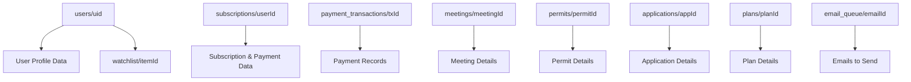
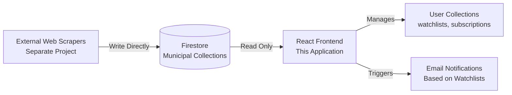
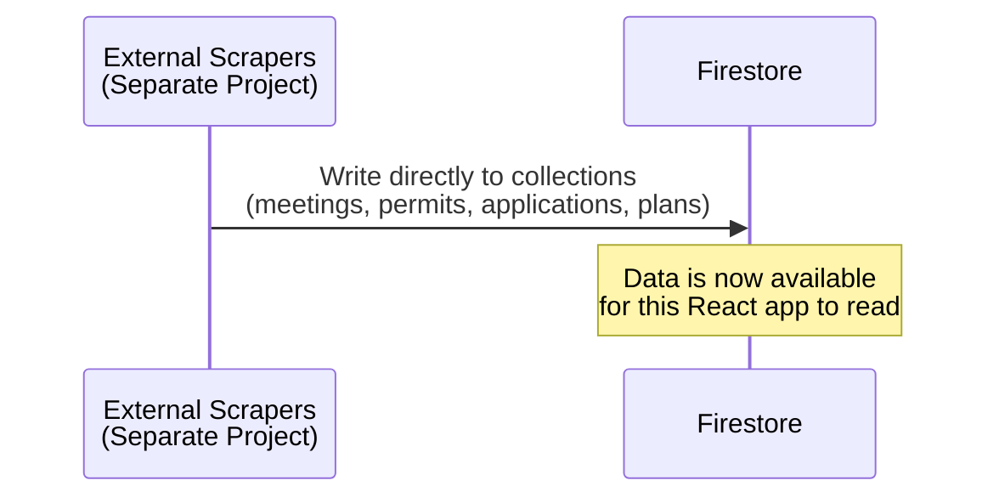
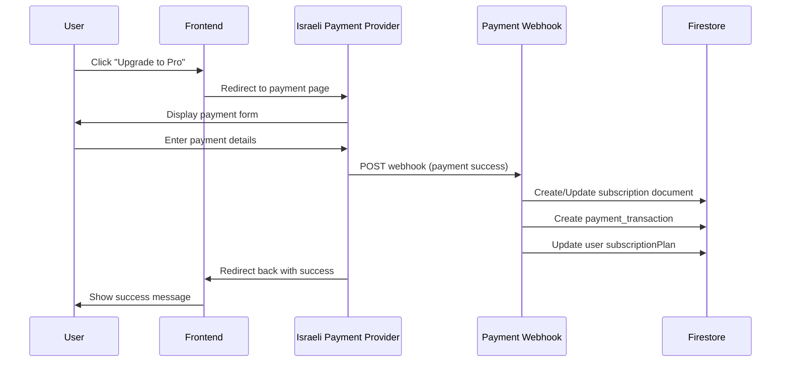
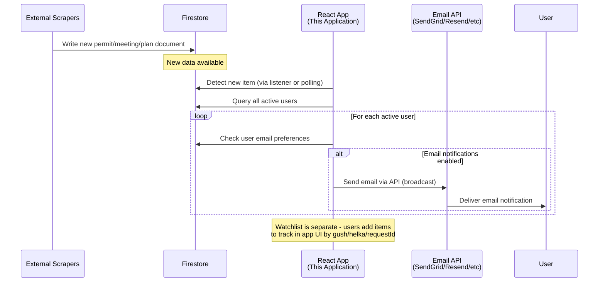

# Firestore Database Schema

**Municipal Dashboard Platform**  
Version: 1.2  
Last Updated: December 28, 2025

---

## Table of Contents

1. [Introduction](#introduction)
2. [Architecture Overview](#architecture-overview)
3. [Collection Schemas](#collection-schemas)
4. [Data Flow](#data-flow)
5. [Security Rules](#security-rules)
6. [Indexing Strategy](#indexing-strategy)
7. [Query Patterns](#query-patterns)
8. [Scalability Considerations](#scalability-considerations)
9. [Integration Points](#integration-points)

---

## Introduction

### Purpose

This document defines the complete Firestore database schema for the Municipal Dashboard platform - a SaaS application that aggregates and displays Israeli municipal data including planning committee meetings, construction permits, planning applications, and urban planning publications.

### Architecture Overview

**Important**: This React application is a **presentation and access control layer**. The municipal data is populated by external scrapers (separate project) that write directly to Firestore. This app:

- **Reads** municipal data from Firestore collections
- **Controls access** based on user subscription plans
- **Manages watchlists** - tracks which items users want to follow
- **Sends notifications** - emails when watched items are updated
- **Manages user accounts** - authentication, subscriptions, preferences

The scrapers operate independently and write all municipal data to Firestore. This app decides **who sees what** and **when to notify users**.

### Technology Stack

- **Database**: Cloud Firestore (Firebase)
- **Authentication**: Firebase Authentication (Email/Password + Google OAuth)
- **Payment Processing**: Israeli payment providers (Tranzilla, Cardcom, Meshulam, etc.)
- **Notifications**: Email via Cloud Functions (external service)
- **Data Ingestion**: External web scrapers → Firestore (direct write)
- **Frontend**: React application (read-only for municipal data)

### Design Principles

1. **User-Centric Structure**: Primary data organized under `users/{uid}` path
2. **Denormalization**: Municipal data cached at top-level for efficient querying
3. **Scalability**: Designed for thousands of users and millions of municipal records
4. **Security**: Row-level security with Firestore rules
5. **Cost Optimization**: Indexed queries to minimize reads

---

## Architecture Overview

### Collection Hierarchy



### Data Flow

**Municipal Data Flow** (External Scrapers):


**Key Points**:
- Scrapers write municipal data directly to Firestore (`meetings`, `permits`, `applications`, `plans`)
- This React app reads from Firestore and controls access
- User-specific data (watchlists, subscriptions) is managed by this app
- Email notifications are broadcast to all active users when new data is added (not filtered by watchlist)
- Watchlists are for app UI only - users track items by gush/helka/requestId to see progress

---

## Collection Schemas

### 1. Users Collection

**Path**: `users/{uid}`

Stores user profile information, preferences, and account metadata.

#### Schema Overview

```
users/{uid}
├── uid (string)
├── email (string)
├── displayName (string | null)
├── photoURL (string | null)
├── authProvider ('password' | 'google.com')
├── subscriptionPlan ('free' | 'pro' | 'enterprise')
├── subscriptionStatus ('active' | 'canceled' | 'past_due' | 'trialing')
├── subscriptionStartDate (Timestamp | null)
├── subscriptionEndDate (Timestamp | null)
├── emailNotifications (boolean)
├── marketingEmails (boolean)
├── createdAt (Timestamp)
├── lastLoginAt (Timestamp)
├── onboardingCompleted (boolean)
├── preferredCity (string | null)
├── trialEndDate? (Timestamp)
└── cancelAtPeriodEnd? (boolean)

Subcollections:
└── watchlist/{itemId}
    ├── itemId (string)
    ├── itemType ('meeting' | 'permit' | 'application' | 'plan')
    ├── city (string)
    ├── addedAt (Timestamp)
    ├── gush? (string)
    ├── helka? (string)
    ├── requestId? (string)
    └── date? (Timestamp)
```

#### Schema

```typescript
interface User {
  // Authentication
  uid: string;                    // Firebase Auth UID (document ID)
  email: string;                  // User email address
  displayName: string | null;     // Full name
  photoURL: string | null;        // Profile picture URL
  authProvider: 'password' | 'google.com'; // Auth method used
  
  // Subscription
  subscriptionPlan: 'free' | 'pro' | 'enterprise';
  subscriptionStatus: 'active' | 'canceled' | 'past_due' | 'trialing';
  subscriptionStartDate: Timestamp | null;
  subscriptionEndDate: Timestamp | null;
  
  // Email Preferences
  emailNotifications: boolean;    // Master toggle for broadcast emails (all users receive notifications when new data is added)
  marketingEmails: boolean;       // Newsletter opt-in
  
  // Metadata
  createdAt: Timestamp;
  lastLoginAt: Timestamp;
  onboardingCompleted: boolean;
  preferredCity: string | null;   // Default city filter (e.g., "בת ים")
  
  // Pro/Enterprise specific
  trialEndDate?: Timestamp;       // For trial users
  cancelAtPeriodEnd?: boolean;    // For scheduled cancellations
}
```

#### Example Document

```json
{
  "uid": "abc123def456",
  "email": "yossi.cohen@example.com",
  "displayName": "יוסי כהן",
  "photoURL": "https://lh3.googleusercontent.com/...",
  "authProvider": "google.com",
  
  "subscriptionPlan": "pro",
  "subscriptionStatus": "active",
  "subscriptionStartDate": "2025-01-15T10:30:00Z",
  "subscriptionEndDate": "2026-01-15T10:30:00Z",
  
  "emailNotifications": true,
  "marketingEmails": false,
  
  "createdAt": "2025-01-15T10:30:00Z",
  "lastLoginAt": "2025-12-28T08:45:00Z",
  "onboardingCompleted": true,
  "preferredCity": "בת ים",
  
  "cancelAtPeriodEnd": false
}
```

#### Indexes

- `email` (single field, for lookup)
- `subscriptionPlan` + `subscriptionStatus` (composite, for admin queries)
- `subscriptionEndDate` (single field, for renewal reminders)

---

### 2. User Watchlist Subcollection

**Path**: `users/{uid}/watchlist/{itemId}`

Stores items that a user wants to track in the app UI. Each user has a **single watchlist** - all tracked items are stored in this subcollection. Items reference existing documents in the municipal collections (`meetings`, `permits`, `applications`, `plans`).

**Purpose**: The watchlist is used for **app UI display only** - to group and show related items (by gush/helka/requestId) so users can track progress over time. **Email notifications are broadcast to ALL users** regardless of watchlist - the watchlist does not filter who receives emails.

#### Schema Overview

```
users/{uid}/watchlist/{itemId}
├── itemId (string)
├── itemType ('meeting' | 'permit' | 'application' | 'plan')
├── city (string)
├── addedAt (Timestamp)
├── gush? (string)
├── helka? (string)
├── requestId? (string)
└── date? (Timestamp)
```

#### Schema

```typescript
interface WatchlistItem {
  itemId: string;                 // Document ID (same as the item ID in main collection)
  itemType: 'meeting' | 'permit' | 'application' | 'plan';
  
  // Reference
  city: string;                   // For display (denormalized)
  
  // Tracking
  addedAt: Timestamp;
  
  // Metadata (denormalized for quick display and grouping)
  gush?: string;                  // For grouping items by parcel
  helka?: string;                 // For grouping items by parcel
  requestId?: string;             // For grouping items by application/permit number
  date?: Timestamp;               // meeting_date, permit_date, or published_at
}
```

#### Example Document

```json
{
  "itemId": "dm-1",
  "itemType": "meeting",
  "city": "בת ים",
  "title": "ישיבה מס׳ 2023020",
  "addedAt": "2025-12-20T14:30:00Z",
  "gush": "7144",
  "helka": "25",
  "requestId": "2023-1234",
  "date": "2023-11-01T16:00:00Z"
}
```

#### Indexes

- `itemType` (single field, for filtering)
- `addedAt` (single field, for sorting)

---

### 3. Subscriptions Collection

**Path**: `subscriptions/{userId}`

Tracks active subscriptions and payment details. Document ID matches user UID.

#### Schema Overview

```
subscriptions/{userId}
├── userId (string)
├── planType ('pro' | 'enterprise')
├── status ('active' | 'canceled' | 'past_due' | 'trialing')
├── billingCycle ('monthly' | 'yearly')
├── amount (number) // NIS
├── currency ('ILS')
├── nextBillingDate (Timestamp)
├── paymentProvider ('tranzilla' | 'cardcom' | 'meshulam' | 'manual')
├── customerId (string | null)
├── subscriptionId (string | null)
├── createdAt (Timestamp)
├── updatedAt (Timestamp)
├── lastPaymentDate (Timestamp | null)
├── lastPaymentAmount (number | null)
├── canceledAt (Timestamp | null)
├── cancelReason (string | null)
└── cancelAtPeriodEnd (boolean)
```

#### Schema

```typescript
interface Subscription {
  userId: string;                 // Same as document ID
  
  // Plan Details
  planType: 'pro' | 'enterprise';
  status: 'active' | 'canceled' | 'past_due' | 'trialing';
  
  // Billing
  billingCycle: 'monthly' | 'yearly';
  amount: number;                 // Amount in NIS (shekels)
  currency: 'ILS';
  nextBillingDate: Timestamp;
  
  // Payment Provider
  paymentProvider: 'tranzilla' | 'cardcom' | 'meshulam' | 'manual';
  customerId: string | null;      // Customer ID in payment provider system
  subscriptionId: string | null;  // Recurring subscription ID
  
  // Tracking
  createdAt: Timestamp;
  updatedAt: Timestamp;
  lastPaymentDate: Timestamp | null;
  lastPaymentAmount: number | null;
  
  // Cancellation
  canceledAt: Timestamp | null;
  cancelReason: string | null;
  cancelAtPeriodEnd: boolean;
}
```

#### Example Document

```json
{
  "userId": "abc123def456",
  "planType": "pro",
  "status": "active",
  
  "billingCycle": "monthly",
  "amount": 39,
  "currency": "ILS",
  "nextBillingDate": "2026-01-15T10:30:00Z",
  
  "paymentProvider": "tranzilla",
  "customerId": "cust_tz_98765",
  "subscriptionId": "sub_tz_12345",
  
  "createdAt": "2025-01-15T10:30:00Z",
  "updatedAt": "2025-12-15T10:30:00Z",
  "lastPaymentDate": "2025-12-15T10:30:00Z",
  "lastPaymentAmount": 39,
  
  "canceledAt": null,
  "cancelReason": null,
  "cancelAtPeriodEnd": false
}
```

#### Indexes

- `status` + `nextBillingDate` (composite, for billing cron jobs)
- `paymentProvider` (single field, for provider-specific queries)

---

### 4. Payment Transactions Collection

**Path**: `payment_transactions/{transactionId}`

Records all payment transactions for auditing and reconciliation.

#### Schema Overview

```
payment_transactions/{transactionId}
├── transactionId (string)
├── userId (string)
├── amount (number) // NIS
├── currency ('ILS')
├── status ('pending' | 'completed' | 'failed' | 'refunded')
├── provider ('tranzilla' | 'cardcom' | 'meshulam' | 'manual')
├── providerTransactionId (string | null)
├── providerCustomerId (string | null)
├── planType ('pro' | 'enterprise')
├── billingPeriodStart (Timestamp)
├── billingPeriodEnd (Timestamp)
├── createdAt (Timestamp)
├── completedAt (Timestamp | null)
├── invoiceUrl (string | null)
├── invoiceNumber (string | null)
├── errorMessage (string | null)
├── refundedAt (Timestamp | null)
└── refundReason (string | null)
```

#### Schema

```typescript
interface PaymentTransaction {
  transactionId: string;          // Document ID (from payment provider or generated)
  userId: string;                 // Reference to user
  
  // Transaction Details
  amount: number;                 // Amount in NIS (shekels)
  currency: 'ILS';
  status: 'pending' | 'completed' | 'failed' | 'refunded';
  
  // Payment Provider
  provider: 'tranzilla' | 'cardcom' | 'meshulam' | 'manual';
  providerTransactionId: string | null;
  providerCustomerId: string | null;
  
  // Billing
  planType: 'pro' | 'enterprise';
  billingPeriodStart: Timestamp;
  billingPeriodEnd: Timestamp;
  
  // Tracking
  createdAt: Timestamp;
  completedAt: Timestamp | null;
  
  // Invoice
  invoiceUrl: string | null;      // Link to invoice PDF
  invoiceNumber: string | null;   // Invoice ID for accounting
  
  // Additional
  errorMessage: string | null;    // If status = 'failed'
  refundedAt: Timestamp | null;
  refundReason: string | null;
}
```

#### Example Document

```json
{
  "transactionId": "tx_2025_12345",
  "userId": "abc123def456",
  
  "amount": 39,
  "currency": "ILS",
  "status": "completed",
  
  "provider": "tranzilla",
  "providerTransactionId": "TZ-20251215-9876",
  "providerCustomerId": "cust_tz_98765",
  
  "planType": "pro",
  "billingPeriodStart": "2025-12-15T00:00:00Z",
  "billingPeriodEnd": "2026-01-15T00:00:00Z",
  
  "createdAt": "2025-12-15T10:28:00Z",
  "completedAt": "2025-12-15T10:30:15Z",
  
  "invoiceUrl": "https://storage.googleapis.com/invoices/2025/inv_12345.pdf",
  "invoiceNumber": "INV-2025-12345",
  
  "errorMessage": null,
  "refundedAt": null,
  "refundReason": null
}
```

#### Indexes

- `userId` + `createdAt` (composite, for user transaction history)
- `status` + `createdAt` (composite, for admin dashboard)
- `provider` + `providerTransactionId` (composite, for reconciliation)

---

### 5. Meetings Collection

**Path**: `meetings/{meetingId}`

Stores municipal planning committee meetings scraped from city websites.

#### Schema Overview

```
meetings/{meetingId}
├── id (string)
├── city (string)
├── meetingId (string)
├── meetingDate (Timestamp | null)
├── decisionsCount (number)
├── documentUrl (string | null)
└── rawData? (any)
```

#### Schema

```typescript
interface Meeting {
  id: string;                     // Document ID (UUID)
  
  // Basic Info
  city: string;                   // City name in Hebrew (e.g., "בת ים")
  meetingId: string;              // Official meeting number (e.g., "2023020")
  meetingDate: Timestamp | null;  // When the meeting occurred
  decisionsCount: number;         // Number of decisions/items in meeting
  
  // Documents
  documentUrl: string | null;     // Link to official meeting protocol PDF
  
  // Raw data (for debugging/reprocessing)
  rawData?: any;
}

interface MeetingItemSummary {
  requestId: string;              // Application/permit number
  decision: string;               // Decision text (e.g., "אושר בתנאים")
  subject: string;                // Address/location
  description: string;            // Full description
  applicant?: string;             // Applicant name
  units?: number;                 // Number of housing units
  status?: string;                // Status description
  address: string | null;         // Street address
  gush: string | null;            // Land parcel - gush number
  helka: string | null;           // Land parcel - helka number
}
```

#### Example Document

```json
{
  "id": "dm-1",
  "city": "בת ים",
  "meetingId": "2023020",
  "meetingDate": "2023-11-01T16:00:00Z",
  "decisionsCount": 15,
  
  "documentUrl": "https://www.bat-yam.muni.il/protocols/2023020.pdf"
}
```

#### Indexes

- `city` + `meetingDate` (composite, DESC, for listing by city)
- `meetingDate` (single field, DESC, for recent meetings)
- `city` + `createdAt` (composite, DESC, for new items by city)

---

### 6. Permits Collection

**Path**: `permits/{permitId}`

Stores construction permit records.

#### Schema Overview

```
permits/{permitId}
├── id (string)
├── city (string)
├── requestId (string)
├── permitDate (Timestamp | null)
├── requestType (string)
├── gush (string)
├── helka (string)
├── address? (string)
├── essence (string)
├── applicantName? (string)
└── rawData? (any)
```

#### Schema

```typescript
interface Permit {
  id: string;                     // Document ID (UUID)
  
  // Basic Info
  city: string;                   // City name
  requestId: string;              // Official permit number (e.g., "2023-1550")
  permitDate: Timestamp | null;   // Date permit was issued
  requestType: string;            // Type (e.g., "תמ\"א 38/2", "בנייה חדשה")
  
  // Location
  gush: string;                   // Land parcel - gush number
  helka: string;                  // Land parcel - helka number
  address?: string;               // Street address if available
  
  // Details
  essence: string;                // Description of the permit
  applicantName?: string;         // Applicant/developer name
  
  // Raw data
  rawData?: any;
}
```

#### Example Document

```json
{
  "id": "dp-1",
  "city": "בת ים",
  "requestId": "2023-1550",
  "permitDate": "2023-11-02T00:00:00Z",
  "requestType": "תמ\"א 38/2",
  
  "gush": "7144",
  "helka": "25",
  "address": "רחוב יוספטל 12",
  
  "essence": "הריסת בניין קיים בן 4 קומות והקמת בניין חדש בן 10 קומות",
  "applicantName": "אאורה ישראל"
}
```

#### Indexes

- `city` + `permitDate` (composite, DESC)
- `gush` + `helka` (composite, for parcel searches)
- `city` + `gush` + `permitDate` (composite, for location-based queries)

---

### 7. Applications Collection

**Path**: `applications/{applicationId}`

Stores planning application publications (הודעות על הגשת בקשות).

#### Schema Overview

```
applications/{applicationId}
├── id (string)
├── city (string)
├── requestId (string)
├── publishedAt (Timestamp | null)
├── applicantName (string)
├── description (string)
├── gush? (string)
├── helka? (string)
├── address? (string)
├── status? (string)
├── filingDate? (string)
└── rawData? (any)
```

#### Schema

```typescript
interface Application {
  id: string;                     // Document ID
  
  // Basic Info
  city: string;
  requestId: string;              // Application number
  publishedAt: Timestamp | null;  // Publication date
  
  // Applicant
  applicantName: string;          // Name of applicant/developer
  
  // Details
  description: string;            // What is being requested
  
  // Location
  gush?: string;
  helka?: string;
  address?: string;
  
  // Status
  status?: string;                // Current status (e.g., "בבדיקה")
  filingDate?: string;            // When application was filed
  
  rawData?: any;
}
```

#### Example Document

```json
{
  "id": "da-1",
  "city": "בת ים",
  "requestId": "2024-0012",
  "publishedAt": "2023-11-03T00:00:00Z",
  
  "applicantName": "אאורה ישראל",
  "description": "בקשה להקלה בקווי בניין עבור פרויקט פינוי בינוי במתחם יוספטל",
  
  "gush": "7150",
  "helka": "10-20",
  
  "status": "בבדיקה",
  "filingDate": "2023-09-01"
}
```

#### Indexes

- `city` + `publishedAt` (composite, DESC)
- `gush` + `publishedAt` (composite, DESC)
- `applicantName` + `publishedAt` (composite, for developer tracking)

---

### 8. Plans Collection

**Path**: `plans/{planId}`

Stores urban planning publications (הודעות תכנוניות).

#### Schema Overview

```
plans/{planId}
├── id (string)
├── city (string)
├── planNumber (string)
├── publishedAt (Timestamp | null)
├── messageType (string)
├── planGoal (string)
├── planMainPoints (string)
├── gush? (string)
├── helka? (string)
├── areaDunam? (number)
├── status? (string)
├── depositingDate? (string)
└── rawData? (any)
```

#### Schema

```typescript
interface Plan {
  id: string;                     // Document ID
  
  // Basic Info
  city: string;
  planNumber: string;             // Official plan number (e.g., "502-0998877")
  publishedAt: Timestamp | null;  // Publication date
  
  // Plan Details
  messageType: string;            // Type of message (e.g., "הודעה בדבר אישור תכנית")
  planGoal: string;               // Goal/purpose of the plan
  planMainPoints: string;         // Main points of the plan
  
  // Location
  gush?: string;
  helka?: string;
  areaDunam?: number;             // Area in dunam
  
  // Status
  status?: string;                // Current status (e.g., "בתוקף")
  depositingDate?: string;        // Date of plan deposit
  
  rawData?: any;
}
```

#### Example Document

```json
{
  "id": "dpl-1",
  "city": "בת ים",
  "planNumber": "502-0998877",
  "publishedAt": "2023-11-01T00:00:00Z",
  
  "messageType": "הודעה בדבר אישור תכנית",
  "planGoal": "התחדשות עירונית - מתחם השבטים",
  "planMainPoints": "קביעת זכויות בנייה ל-6 מגדלי מגורים, שטחי מסחר ומבני ציבור. סה\"כ 900 יח\"ד.",
  
  "gush": "7140",
  "helka": "All",
  "areaDunam": 25,
  
  "status": "בתוקף",
  "depositingDate": "2023-10-01"
}
```

#### Indexes

- `city` + `publishedAt` (composite, DESC)
- `planNumber` (single field, for lookup)
- `gush` + `publishedAt` (composite, DESC)

---

### 9. Email Queue Collection

**Path**: `email_queue/{emailId}`

Queue for broadcast emails to be sent to all users when new municipal data is added. When scrapers add new data (meetings, permits, applications, plans), emails are sent to **all active users** regardless of their watchlist. This collection temporarily stores emails before sending via API.

#### Schema Overview

```
email_queue/{emailId}
├── emailId (string)
├── toEmail (string)
├── toName (string)
├── userId (string)
├── templateId (string)
├── subject (string)
├── templateData (any)
├── status ('pending' | 'processing' | 'sent' | 'failed')
├── attempts (number)
├── maxAttempts (number)
├── createdAt (Timestamp)
├── processedAt (Timestamp | null)
├── sentAt (Timestamp | null)
├── errorMessage (string | null)
└── lastAttemptAt (Timestamp | null)
```

#### Schema

```typescript
interface EmailQueueItem {
  emailId: string;                // Document ID
  
  // Recipient
  toEmail: string;
  toName: string;
  userId: string;                 // Reference to user
  
  // Email Content
  templateId: string;             // Email template name
  subject: string;
  templateData: any;              // Template variables
  
  // Delivery
  status: 'pending' | 'processing' | 'sent' | 'failed';
  attempts: number;               // Retry count
  maxAttempts: number;            // Maximum retries (default 3)
  
  // Tracking
  createdAt: Timestamp;
  processedAt: Timestamp | null;
  sentAt: Timestamp | null;
  
  // Error handling
  errorMessage: string | null;
  lastAttemptAt: Timestamp | null;
}
```

#### Example Document

```json
{
  "emailId": "email_12345",
  "toEmail": "yossi.cohen@example.com",
  "toName": "יוסי כהן",
  "userId": "abc123def456",
  
  "templateId": "new_item_broadcast",
  "subject": "עדכון: היתר בנייה חדש בבת ים",
  "templateData": {
    "itemType": "permit",
    "itemTitle": "היתר מס׳ 2023-1550",
    "itemUrl": "https://municipal-dashboard.com/dashboard/permits/dp-1",
    "city": "בת ים",
    "gush": "7144",
    "helka": "25"
  },
  
  "status": "pending",
  "attempts": 0,
  "maxAttempts": 3,
  
  "createdAt": "2023-11-04T10:00:00Z",
  "processedAt": null,
  "sentAt": null,
  
  "errorMessage": null,
  "lastAttemptAt": null
}
```

#### Indexes

- `status` + `createdAt` (composite, for processing queue)
- `userId` + `createdAt` (composite, for user email history)

---

## Data Flow

### Scraper to Firestore Flow

**Note**: This flow is handled by external scrapers (separate project). This app only reads the data.



**How This App Responds**:
- When scrapers add new items to Firestore, this app:
  1. Sends broadcast email notifications to **all active users** (regardless of watchlist)
  2. Users can add items to their watchlist in the app to track progress by gush/helka/requestId

### User Subscription Flow



### Broadcast Email Flow

**Note**: When new municipal data is added, emails are broadcast to ALL users. Watchlists are for app UI tracking only.



---

## Security Rules

### Firestore Security Rules

```javascript
rules_version = '2';
service cloud.firestore {
  match /databases/{database}/documents {
    
    // Helper functions
    function isAuthenticated() {
      return request.auth != null;
    }
    
    function isOwner(userId) {
      return isAuthenticated() && request.auth.uid == userId;
    }
    
    function hasActivePlan() {
      let user = get(/databases/$(database)/documents/users/$(request.auth.uid));
      return user.data.subscriptionStatus == 'active' && 
             user.data.subscriptionPlan in ['pro', 'enterprise'];
    }
    
    // Users collection
    match /users/{userId} {
      allow read: if isOwner(userId);
      allow create: if isOwner(userId);
      allow update: if isOwner(userId);
      allow delete: if false; // Prevent deletion
      
      // User watchlist subcollection
      match /watchlist/{itemId} {
        allow read, write: if isOwner(userId);
      }
    }
    
    // Subscriptions collection
    match /subscriptions/{userId} {
      allow read: if isOwner(userId);
      allow write: if false; // Only Cloud Functions can write
    }
    
    // Payment transactions
    match /payment_transactions/{transactionId} {
      allow read: if isAuthenticated() && 
                     resource.data.userId == request.auth.uid;
      allow write: if false; // Only Cloud Functions can write
    }
    
    // Municipal data collections (read-only for users with active plans)
    // Note: External scrapers write to these collections (separate service account)
    match /meetings/{meetingId} {
      allow read: if hasActivePlan();
      allow write: if false; // Only external scrapers can write (via service account)
    }
    
    match /permits/{permitId} {
      allow read: if hasActivePlan();
      allow write: if false; // Only external scrapers can write (via service account)
    }
    
    match /applications/{applicationId} {
      allow read: if hasActivePlan();
      allow write: if false; // Only external scrapers can write (via service account)
    }
    
    match /plans/{planId} {
      allow read: if hasActivePlan();
      allow write: if false; // Only external scrapers can write (via service account)
    }
    
    // Email queue (no user access)
    match /email_queue/{emailId} {
      allow read, write: if false;
    }
  }
}
```

---

## Indexing Strategy

### Required Composite Indexes

Create these indexes in the Firebase Console or via `firestore.indexes.json`:

```json
{
  "indexes": [
    {
      "collectionGroup": "meetings",
      "queryScope": "COLLECTION",
      "fields": [
        { "fieldPath": "city", "order": "ASCENDING" },
        { "fieldPath": "meetingDate", "order": "DESCENDING" }
      ]
    },
    {
      "collectionGroup": "permits",
      "queryScope": "COLLECTION",
      "fields": [
        { "fieldPath": "city", "order": "ASCENDING" },
        { "fieldPath": "permitDate", "order": "DESCENDING" }
      ]
    },
    {
      "collectionGroup": "permits",
      "queryScope": "COLLECTION",
      "fields": [
        { "fieldPath": "gush", "order": "ASCENDING" },
        { "fieldPath": "helka", "order": "ASCENDING" }
      ]
    },
    {
      "collectionGroup": "permits",
      "queryScope": "COLLECTION",
      "fields": [
        { "fieldPath": "city", "order": "ASCENDING" },
        { "fieldPath": "gush", "order": "ASCENDING" },
        { "fieldPath": "permitDate", "order": "DESCENDING" }
      ]
    },
    {
      "collectionGroup": "applications",
      "queryScope": "COLLECTION",
      "fields": [
        { "fieldPath": "city", "order": "ASCENDING" },
        { "fieldPath": "publishedAt", "order": "DESCENDING" }
      ]
    },
    {
      "collectionGroup": "applications",
      "queryScope": "COLLECTION",
      "fields": [
        { "fieldPath": "gush", "order": "ASCENDING" },
        { "fieldPath": "publishedAt", "order": "DESCENDING" }
      ]
    },
    {
      "collectionGroup": "plans",
      "queryScope": "COLLECTION",
      "fields": [
        { "fieldPath": "city", "order": "ASCENDING" },
        { "fieldPath": "publishedAt", "order": "DESCENDING" }
      ]
    },
    {
      "collectionGroup": "subscriptions",
      "queryScope": "COLLECTION",
      "fields": [
        { "fieldPath": "status", "order": "ASCENDING" },
        { "fieldPath": "nextBillingDate", "order": "ASCENDING" }
      ]
    },
    {
      "collectionGroup": "payment_transactions",
      "queryScope": "COLLECTION",
      "fields": [
        { "fieldPath": "userId", "order": "ASCENDING" },
        { "fieldPath": "createdAt", "order": "DESCENDING" }
      ]
    },
    {
      "collectionGroup": "email_queue",
      "queryScope": "COLLECTION",
      "fields": [
        { "fieldPath": "status", "order": "ASCENDING" },
        { "fieldPath": "createdAt", "order": "ASCENDING" }
      ]
    }
  ],
  "fieldOverrides": []
}
```

---

## Query Patterns

### Common Query Examples

#### 1. Get Recent Meetings for a City

```typescript
const meetingsQuery = query(
  collection(db, 'meetings'),
  where('city', '==', 'בת ים'),
  orderBy('meetingDate', 'desc'),
  limit(20)
);
```

#### 2. Get User's Watchlist Items

```typescript
const watchlistQuery = query(
  collection(db, `users/${userId}/watchlist`),
  orderBy('addedAt', 'desc')
);
```

#### 3. Find Permits by Gush/Helka

```typescript
const permitsQuery = query(
  collection(db, 'permits'),
  where('gush', '==', '7144'),
  where('helka', '==', '25')
);
```

#### 4. Get Pending Emails to Send

```typescript
const emailsQuery = query(
  collection(db, 'email_queue'),
  where('status', '==', 'pending'),
  orderBy('createdAt', 'asc'),
  limit(100)
);
```

#### 5. Get User Transaction History

```typescript
const transactionsQuery = query(
  collection(db, 'payment_transactions'),
  where('userId', '==', userId),
  orderBy('createdAt', 'desc'),
  limit(50)
);
```

#### 6. Find Subscriptions Due for Renewal

```typescript
const tomorrow = new Date();
tomorrow.setDate(tomorrow.getDate() + 1);

const renewalsQuery = query(
  collection(db, 'subscriptions'),
  where('status', '==', 'active'),
  where('nextBillingDate', '<=', Timestamp.fromDate(tomorrow))
);
```

---

## Scalability Considerations

### 1. Document Size Limits

- **Firestore Limit**: 1 MB per document
- **Strategy**: Keep `meetingItems` array in meetings documents under 100 items. For larger meetings, consider a subcollection.

### 2. Write Limitations

- **Firestore Limit**: 1 write per second per document
- **Strategy**: Use batch writes for scraper updates. Avoid "hot" documents (counters).

### 3. Read Optimization

- **Denormalization**: Store commonly queried fields (city, date, gush/helka) at top level
- **Pagination**: Always use `limit()` and cursor-based pagination for large lists
- **Caching**: Implement client-side caching for frequently accessed data

### 4. Cost Optimization

- **Indexes**: Only create necessary composite indexes
- **Queries**: Use indexed queries to minimize document reads
- **Real-time listeners**: Use sparingly; prefer one-time reads for static data

### 5. Data Archival

For meetings/permits older than 5 years:
- Move to Cloud Storage (compressed JSON)
- Keep metadata in Firestore with `archived: true` flag
- Use Cloud Functions for archive/restore operations

### 6. Multi-Region Support

For future expansion:
- Use Firestore multi-region location (e.g., `eur3`)
- Consider regional sharding if serving international users
- CDN for static assets (meeting PDFs, images)

---

## Integration Points

### 1. Firebase Authentication

**Setup**:
- Enable Email/Password provider
- Enable Google OAuth provider
- Configure authorized domains
- Set up password reset email templates

**User Creation Flow**:
```typescript
// On Firebase Auth user creation trigger
export const onUserCreate = functions.auth.user().onCreate(async (user) => {
  await db.collection('users').doc(user.uid).set({
    uid: user.uid,
    email: user.email,
    displayName: user.displayName || null,
    photoURL: user.photoURL || null,
    authProvider: user.providerData[0]?.providerId || 'password',
    subscriptionPlan: 'free',
    subscriptionStatus: 'active',
    subscriptionStartDate: null,
    subscriptionEndDate: null,
    emailNotifications: true,
    marketingEmails: false,
    createdAt: FieldValue.serverTimestamp(),
    lastLoginAt: FieldValue.serverTimestamp(),
    onboardingCompleted: false,
    preferredCity: null
  });
});
```

### 2. Israeli Payment Providers

**Supported Providers**:
- Tranzilla
- Cardcom
- Meshulam

**Integration Steps**:
1. User clicks "Upgrade to Pro"
2. Frontend redirects to payment provider hosted page
3. User completes payment
4. Payment provider sends webhook to Cloud Function
5. Cloud Function validates webhook signature
6. Cloud Function creates subscription and transaction records
7. Cloud Function updates user document

**Webhook Handler Example**:
```typescript
export const paymentWebhook = functions.https.onRequest(async (req, res) => {
  // Validate webhook signature
  const isValid = validateWebhookSignature(req);
  if (!isValid) {
    res.status(401).send('Invalid signature');
    return;
  }
  
  const { userId, amount, transactionId, status } = req.body;
  
  if (status === 'completed') {
    // Update subscription
    await db.collection('subscriptions').doc(userId).set({
      userId,
      planType: 'pro',
      status: 'active',
      billingCycle: 'monthly',
      amount: 39,
      currency: 'ILS',
      nextBillingDate: getNextBillingDate(),
      paymentProvider: 'tranzilla',
      customerId: req.body.customerId,
      subscriptionId: req.body.subscriptionId,
      lastPaymentDate: FieldValue.serverTimestamp(),
      lastPaymentAmount: amount,
      updatedAt: FieldValue.serverTimestamp()
    }, { merge: true });
    
    // Create transaction record
    await db.collection('payment_transactions').add({
      transactionId,
      userId,
      amount,
      currency: 'ILS',
      status: 'completed',
      provider: 'tranzilla',
      providerTransactionId: req.body.providerTxId,
      planType: 'pro',
      billingPeriodStart: Timestamp.now(),
      billingPeriodEnd: Timestamp.fromDate(getNextBillingDate()),
      createdAt: FieldValue.serverTimestamp(),
      completedAt: FieldValue.serverTimestamp()
    });
    
    // Update user document
    await db.collection('users').doc(userId).update({
      subscriptionPlan: 'pro',
      subscriptionStatus: 'active'
    });
  }
  
  res.status(200).send('OK');
});
```

### 3. Email Notifications

**Broadcast Model - Send to All Users**:

When new municipal data is added, emails are broadcast to all active users via email API (SendGrid, Resend, etc.):

```typescript
// Example: React app detecting new data and broadcasting emails
import { collection, query, where, getDocs } from 'firebase/firestore';
import { sendEmail } from './emailService'; // Your email API wrapper

export async function broadcastNewItemNotification(newItem: Permit | Meeting | Application | Plan) {
  // Get all active users with email notifications enabled
  const usersQuery = query(
    collection(db, 'users'),
    where('subscriptionStatus', '==', 'active'),
    where('emailNotifications', '==', true)
  );
  
  const usersSnapshot = await getDocs(usersQuery);
  
  // Broadcast to all users
  const emailPromises = usersSnapshot.docs.map(async (userDoc) => {
    const user = userDoc.data();
    
    try {
      // Send email directly via API
      await sendEmail({
        to: user.email,
        subject: `עדכון: ${getItemTypeLabel(newItem)} חדש ב${newItem.city}`,
        template: 'new_item_broadcast',
        data: {
          itemType: getItemType(newItem),
          itemTitle: getItemTitle(newItem),
          itemUrl: getItemUrl(newItem),
          city: newItem.city,
          gush: newItem.gush,
          helka: newItem.helka
        }
      });
    } catch (error) {
      console.error(`Failed to send email to ${user.email}:`, error);
    }
  });
  
  await Promise.allSettled(emailPromises);
}
```

**Note**: Watchlists are separate - users add items to their watchlist in the app UI to track progress by gush/helka/requestId. Watchlists do not affect who receives email notifications.

### 4. Scraper Integration

**Note**: Scrapers are external (separate project) and write directly to Firestore using Firebase Admin SDK with service account credentials. This React app does not include scraper code.

**How External Scrapers Write Data**:

Scrapers (in separate project) use Firebase Admin SDK to write directly to Firestore:

```typescript
// Example: How external scrapers write data (NOT part of this React app)
import admin from 'firebase-admin';

// Scrapers initialize with service account
admin.initializeApp({
  credential: admin.credential.cert(serviceAccount)
});

const db = admin.firestore();

// Scrapers write directly to collections
await db.collection('meetings').doc(meetingId).set({
  id: meetingId,
  city: 'בת ים',
  meetingId: '2023020',
  meetingDate: admin.firestore.Timestamp.fromDate(new Date()),
  // ... rest of meeting data
  createdAt: admin.firestore.FieldValue.serverTimestamp(),
  updatedAt: admin.firestore.FieldValue.serverTimestamp()
});
```

**How This React App Detects Changes**:

This app can detect new items using Firestore listeners or Cloud Functions, then broadcast emails to all users:

```typescript
// Example: React app or Cloud Function listening for new permits
import { collection, query, orderBy, limit, onSnapshot } from 'firebase/firestore';

const permitsRef = collection(db, 'permits');
const q = query(
  permitsRef,
  orderBy('id', 'desc'), // Order by document ID or another field
  limit(10)
);

onSnapshot(q, (snapshot) => {
  snapshot.docChanges().forEach((change) => {
    if (change.type === 'added') {
      // New item detected - broadcast to all users
      broadcastNewItemNotification(change.doc.data());
    }
  });
});
```

**Note**: Watchlists are managed separately in the app UI - users add items to track progress by gush/helka/requestId. Watchlists do not filter email notifications.

---

## Migration Considerations

### Phase 1: Initial Setup
1. Create Firestore database in Firebase Console
2. Set up authentication providers
3. Deploy security rules
4. Create composite indexes
5. Set up Cloud Functions

### Phase 2: Data Import
1. Import city metadata
2. Run initial scrapers for historical data
3. Verify data integrity
4. Set up monitoring and alerts

### Phase 3: User Migration (if applicable)
1. Export existing user data
2. Create Firebase Auth accounts
3. Import user profiles to Firestore
4. Migrate subscription data
5. Send notification emails to users

### Future Schema Changes

**Best Practices**:
- Never remove fields (mark as deprecated)
- Add new fields with default values
- Use Cloud Functions for data migrations
- Test migrations on copy of production data
- Implement versioning for complex schema changes

**Example Migration Function**:
```typescript
export const migrateUserSchema = functions.https.onRequest(async (req, res) => {
  const users = await db.collection('users').get();
  
  const batch = db.batch();
  users.docs.forEach(doc => {
    batch.update(doc.ref, {
      // Add new field with default value
      newField: 'defaultValue',
      schemaVersion: 2
    });
  });
  
  await batch.commit();
  res.status(200).send('Migration complete');
});
```

---

## Appendix

### Firestore Indexes Configuration File

Save as `firestore.indexes.json` in project root:

```json
{
  "indexes": [
    {
      "collectionGroup": "meetings",
      "queryScope": "COLLECTION",
      "fields": [
        { "fieldPath": "city", "order": "ASCENDING" },
        { "fieldPath": "meetingDate", "order": "DESCENDING" }
      ]
    },
    {
      "collectionGroup": "permits",
      "queryScope": "COLLECTION",
      "fields": [
        { "fieldPath": "city", "order": "ASCENDING" },
        { "fieldPath": "permitDate", "order": "DESCENDING" }
      ]
    },
    {
      "collectionGroup": "permits",
      "queryScope": "COLLECTION",
      "fields": [
        { "fieldPath": "gush", "order": "ASCENDING" },
        { "fieldPath": "helka", "order": "ASCENDING" }
      ]
    },
    {
      "collectionGroup": "permits",
      "queryScope": "COLLECTION",
      "fields": [
        { "fieldPath": "city", "order": "ASCENDING" },
        { "fieldPath": "gush", "order": "ASCENDING" },
        { "fieldPath": "permitDate", "order": "DESCENDING" }
      ]
    },
    {
      "collectionGroup": "applications",
      "queryScope": "COLLECTION",
      "fields": [
        { "fieldPath": "city", "order": "ASCENDING" },
        { "fieldPath": "publishedAt", "order": "DESCENDING" }
      ]
    },
    {
      "collectionGroup": "applications",
      "queryScope": "COLLECTION",
      "fields": [
        { "fieldPath": "gush", "order": "ASCENDING" },
        { "fieldPath": "publishedAt", "order": "DESCENDING" }
      ]
    },
    {
      "collectionGroup": "plans",
      "queryScope": "COLLECTION",
      "fields": [
        { "fieldPath": "city", "order": "ASCENDING" },
        { "fieldPath": "publishedAt", "order": "DESCENDING" }
      ]
    },
    {
      "collectionGroup": "subscriptions",
      "queryScope": "COLLECTION",
      "fields": [
        { "fieldPath": "status", "order": "ASCENDING" },
        { "fieldPath": "nextBillingDate", "order": "ASCENDING" }
      ]
    },
    {
      "collectionGroup": "payment_transactions",
      "queryScope": "COLLECTION",
      "fields": [
        { "fieldPath": "userId", "order": "ASCENDING" },
        { "fieldPath": "createdAt", "order": "DESCENDING" }
      ]
    },
    {
      "collectionGroup": "email_queue",
      "queryScope": "COLLECTION",
      "fields": [
        { "fieldPath": "status", "order": "ASCENDING" },
        { "fieldPath": "createdAt", "order": "ASCENDING" }
      ]
    }
  ],
  "fieldOverrides": []
}
```

---

## Document History

| Version | Date | Changes | Author |
|---------|------|---------|--------|
| 1.0 | 2025-12-28 | Initial schema design | System |
| 1.1 | 2025-12-28 | Clarified architecture: scrapers are external, app is read-only for municipal data, single watchlist per user | System |
| 1.2 | 2025-12-28 | Updated email model: broadcast to all users (not filtered by watchlist), watchlist is for app UI tracking only | System |

---

**End of Document**

